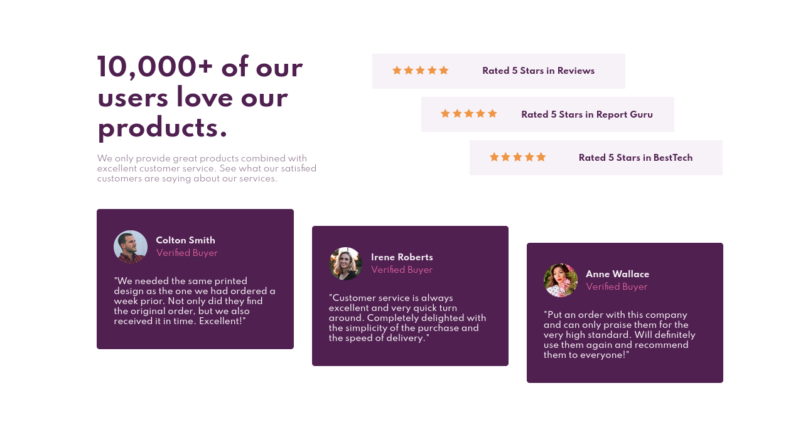

# Social proof section solution

## Overview

The challenge is to make a webpage similar to that of a given design

Users should be able to:

- View the optimal layout for the section depending on their device's screen size

### Screenshot

- Solution URL: [Live Demo](https://andrew-lc.github.io/Social-Testimonial-Review-Page/)

### Built with

- Semantic HTML5 markup
- CSS custom properties
- Flexbox
- Mobile-first workflow
